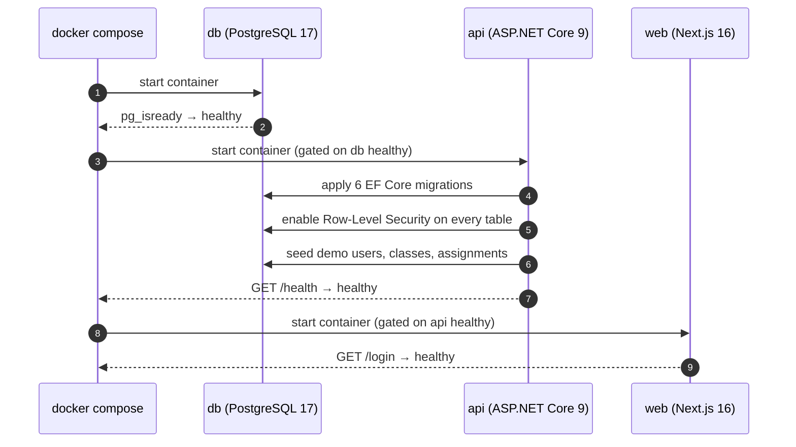
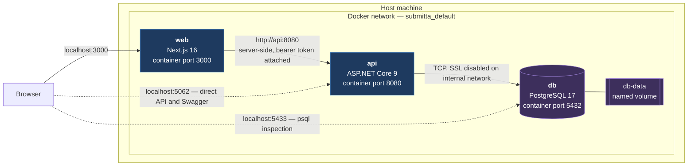
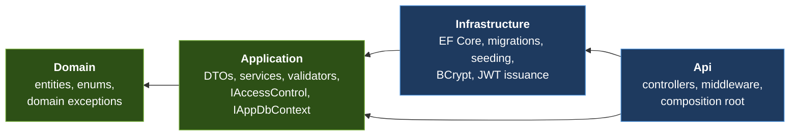
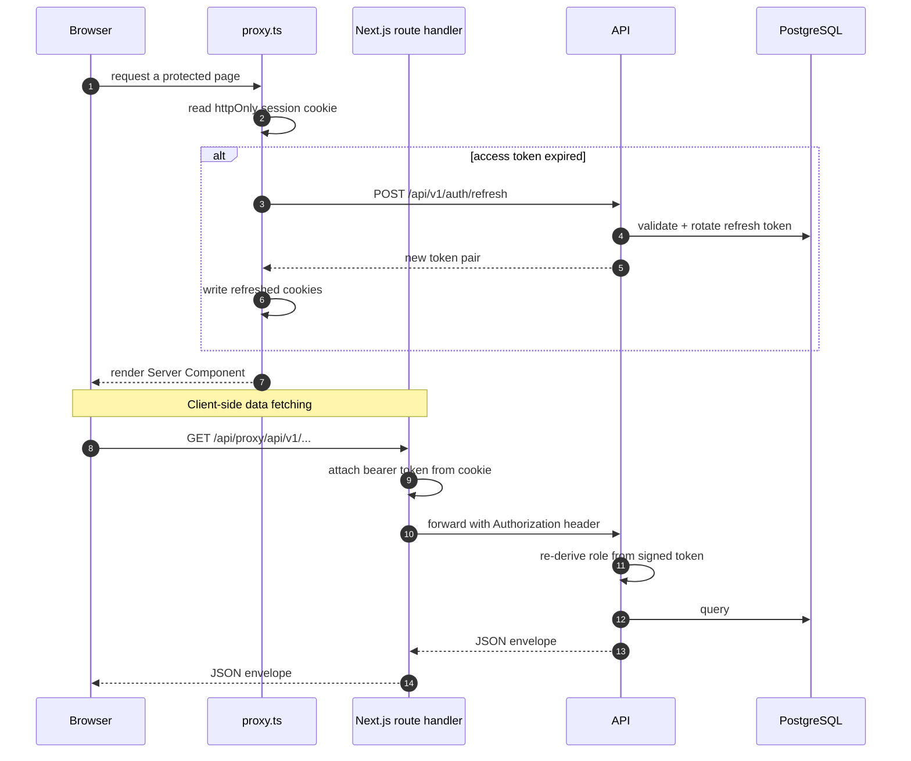
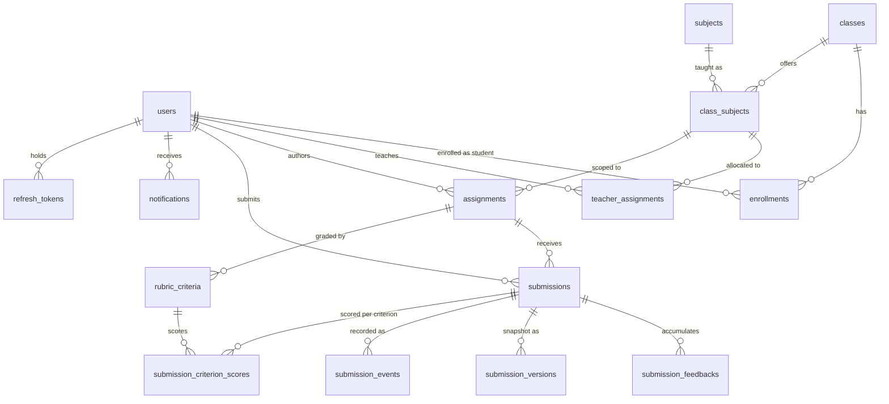
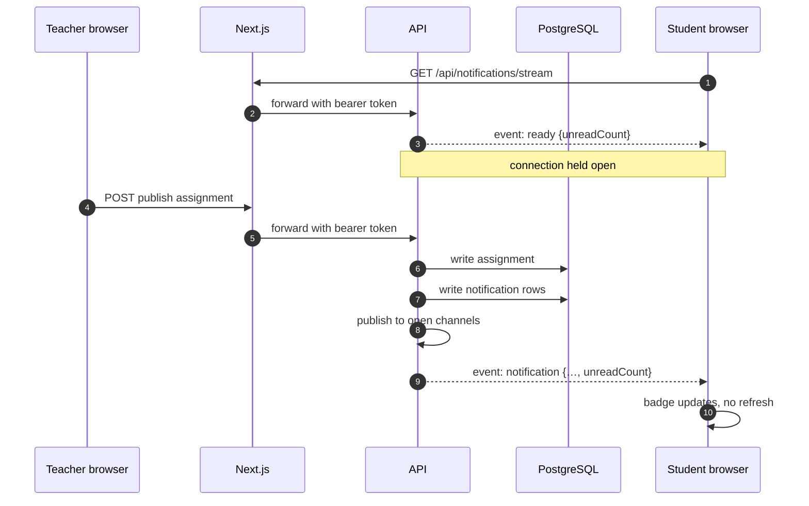

# Submitta — Assignment & Submission Management System

A role-based web application for managing coursework in schools and colleges.
Teachers set assignments against a class and subject, students submit and revise
their work, and teachers return marks and feedback. Administrators manage users,
classes, subjects and teaching allocations.

Developed as the technical assignment for the Assistant Software Engineer
position at OnnoRokom Projukti Limited.

**ASP.NET Core 9 · PostgreSQL 17 · Next.js 16 · TypeScript · Docker · xUnit**

---

## Contents

**Getting started**
1. [Overview](#1-overview)
2. [Running with Docker](#2-running-with-docker)
3. [Running without Docker](#3-running-without-docker)
4. [Configuration reference](#4-configuration-reference)
5. [Demo credentials](#5-demo-credentials)

**Design**

6. [Architecture](#6-architecture)
7. [Data model](#7-data-model)
8. [Technology stack](#8-technology-stack)
9. [Project structure](#9-project-structure)

**Functionality**

10. [Functional scope by role](#10-functional-scope-by-role)
11. [Authorization and business rules](#11-authorization-and-business-rules)
12. [Assignment authoring and grading](#12-assignment-authoring-and-grading)
13. [The writing editor and replay](#13-the-writing-editor-and-replay)
14. [Notifications](#14-notifications)

**Operations**

15. [Database and migrations](#15-database-and-migrations)
16. [Database security](#16-database-security)
17. [Testing](#17-testing)
18. [API reference](#18-api-reference)
19. [Troubleshooting](#19-troubleshooting)

**Appendices**

20. [Design assumptions](#20-design-assumptions)
21. [Known limitations](#21-known-limitations)
22. [Future work](#22-future-work)

---

## 1. Overview

The system implements three roles with distinct capabilities, enforced entirely
on the server:

| Role | Responsibility |
|---|---|
| **Administrator** | User accounts, classes, subjects, teaching allocations, enrolment, system settings |
| **Teacher** | Authoring assignments for their own allocations, reviewing submissions, awarding marks and feedback |
| **Student** | Viewing published assignments, submitting and revising work, viewing marks and feedback |

The repository contains the complete deliverable: backend API, frontend
application, database migrations, a standalone schema script, seed data, unit
tests and container configuration. No table needs to be created by hand.

### Deployment options

| Method | Prerequisites | Section |
|---|---|---|
| **Docker Compose** (recommended) | Docker Desktop | [Section 2](#2-running-with-docker) |
| **Local toolchain** | .NET 9 SDK, Node.js 20+, PostgreSQL 14+ | [Section 3](#3-running-without-docker) |

---

## 2. Running with Docker

### 2.1 Prerequisites

Docker Desktop, including Compose v2. Verified against Docker 27.5.1 and Compose
v2.32.4 on Apple Silicon.

```bash
docker --version && docker compose version
```

Nothing else is required. The .NET SDK, Node.js and PostgreSQL are all supplied
by the images.

### 2.2 Starting the stack

From the repository root:

```bash
docker compose up --build
```

The first build takes several minutes while the base images are pulled and the
two applications are compiled. Subsequent builds reuse the layer cache.

Add `-d` to run detached:

```bash
docker compose up --build -d
```

### 2.3 Service endpoints

| Service | URL | Notes |
|---|---|---|
| **Web application** | <http://localhost:3000> | The application itself |
| **API** | <http://localhost:5062> | Direct access, not required for normal use |
| **Swagger UI** | <http://localhost:5062/swagger> | Available in Development mode |
| **Health check** | <http://localhost:5062/health> | Anonymous, for probes |
| **PostgreSQL** | `localhost:5433` | Port 5433 avoids collision with a host PostgreSQL |

Sign in with any account from [Section 5](#5-demo-credentials).

### 2.4 What happens on first start

Startup is ordered by health checks rather than by fixed delays, so the API
never starts against a database that is still initialising.



Verified startup log from a clean volume:

```
[INF] Applying 6 pending migration(s): InitialSchema, RichEditorAndReplay,
      Notifications, EnableRowLevelSecurity, AssignmentAuthoringAndGrading,
      RemoveAssignmentAttachments
[INF] Row-Level Security enabled across the public schema (0 table(s) still unprotected).
[INF] Seeding database…
[INF] Seeded 6 User row(s).
[INF] Seeded 4 Assignment row(s).
[INF] Seeding complete.
[INF] Now listening on: http://[::]:8080
```

### 2.5 Common operations

Check status — all three services should report `healthy`:

```bash
docker compose ps
```

Follow logs for one service:

```bash
docker compose logs -f api
```

Stop the stack, keeping the database:

```bash
docker compose down
```

Stop and **discard the database**, returning to a clean slate:

```bash
docker compose down --volumes
```

Rebuild one service after a code change:

```bash
docker compose up --build -d api
```

Open a psql session against the containerised database:

```bash
docker compose exec db psql -U submitta -d assignment_system
```

### 2.6 Running the test suite in Docker

The backend Dockerfile exposes a `test` stage, so the suite runs on the same SDK
image the application is compiled with:

```bash
docker build --target test ./backend
```

Result:

```
Passed!  - Failed: 0, Passed: 152, Skipped: 0, Total: 152, Duration: 11 s
```

### 2.7 Image structure

Both Dockerfiles are multi-stage. Build tooling is confined to the build stages
and never reaches the published image.

| Image | Base | Size | Contents |
|---|---|---|---|
| `submitta-api` | `mcr.microsoft.com/dotnet/aspnet:9.0` | 289 MB | Published assemblies only; no SDK, no source |
| `submitta-web` | `node:22-alpine` | 219 MB | Next.js standalone output; no build toolchain, no dev dependencies |
| `postgres:17-alpine` | official | 291 MB | Unmodified |

Both application images run as a **non-root user** (`app` in the API image,
`node` in the web image) and declare a `HEALTHCHECK`.

The web image relies on `output: "standalone"` in `next.config.ts`, which emits
a self-contained server carrying only the modules the traced build reaches.

### 2.8 Switching to Production mode

The stack defaults to `ASPNETCORE_ENVIRONMENT=Development`, which publishes
Swagger and uses the development signing key committed in
`appsettings.Development.json`. This keeps evaluation free of setup steps.

For a production-shaped run, create a `.env` beside `docker-compose.yml`:

```bash
cp .env.example .env
```

Then set both values together — the API refuses to start outside Development
without a signing key:

```ini
ASPNETCORE_ENVIRONMENT=Production
Jwt__Key=<output of: openssl rand -base64 48>
```

`.env` is git-ignored. Only `.env.example` is committed.

---

## 3. Running without Docker

### 3.1 Prerequisites

| Tool | Version | Verify with |
|---|---|---|
| .NET SDK | 9.0+ | `dotnet --version` |
| Node.js | 20+ | `node --version` |
| PostgreSQL | 14+ | `psql --version` |

On macOS with [Homebrew](https://brew.sh):

```bash
brew install --cask dotnet-sdk && brew install node postgresql@16
```

```bash
brew services start postgresql@16
```

### 3.2 Create an empty database

This is the only manual database step. The application creates every table
itself on first run.

```bash
createdb assignment_system
```

### 3.3 Configure and start the API

```bash
cp backend/.env.example backend/.env
```

Edit `ConnectionStrings__DefaultConnection` in `backend/.env` so the host, user,
password and database name match your PostgreSQL instance. Then:

```bash
dotnet run --project backend/src/AssignmentSystem.Api
```

The API applies all migrations and seeds demo data before accepting requests.
It listens on <http://localhost:5062>.

### 3.4 Configure and start the frontend

In a second terminal:

```bash
cp frontend/.env.example frontend/.env.local
```

```bash
cd frontend && npm install && npm run dev
```

The application is served at <http://localhost:3000>.

### 3.5 Production build of the frontend

```bash
cd frontend && npm run build && npm run start
```

---

## 4. Configuration reference

Configuration is supplied through environment variables in all cases. No secret
is committed; every `.env` file is git-ignored and accompanied by a
`.env.example` showing the required keys with placeholder values.

| File | Applies to | Committed |
|---|---|---|
| `.env.example` → `.env` | Docker Compose stack | Example only |
| `backend/.env.example` → `backend/.env` | `dotnet run` | Example only |
| `frontend/.env.example` → `frontend/.env.local` | `npm run dev` | Example only |

### 4.1 Backend variables

| Variable | Required | Default | Purpose |
|---|---|---|---|
| `ConnectionStrings__DefaultConnection` | Yes | — | PostgreSQL connection. URI and keyword forms both accepted |
| `ASPNETCORE_ENVIRONMENT` | No | `Production` | `Development` enables Swagger and the development signing key |
| `Jwt__Key` | Outside Development | — | HMAC-SHA256 signing key, minimum 32 characters |
| `Jwt__AccessTokenMinutes` | No | `15` | Access token lifetime |
| `Jwt__RefreshTokenDays` | No | `7` | Refresh token lifetime |
| `Cors__AllowedOrigins__0` | No | `http://localhost:3000` | Permitted browser origin |
| `Seed__Enabled` | No | `true` | Whether demo data is seeded |
| `Seed__DefaultPassword` | No | `Demo@1234` | Password given to seeded accounts |

TLS mode is derived from the host: disabled for loopback and single-label
hostnames such as a Compose service name, required for anything fully qualified.
Append `?sslmode=…` to override.

### 4.2 Frontend variables

| Variable | Required | Default | Purpose |
|---|---|---|---|
| `API_BASE_URL` | No | `http://localhost:5062` | API address, read **server-side only** |

Under Compose this is set to `http://api:8080`, the internal service address.
The browser never uses this value; see [Section 6.3](#63-frontend-request-flow).

### 4.3 Compose-only variables

| Variable | Default | Purpose |
|---|---|---|
| `WEB_PORT` | `3000` | Host port for the web application |
| `API_PORT` | `5062` | Host port for the API |
| `DB_PORT` | `5433` | Host port for PostgreSQL |
| `POSTGRES_PASSWORD` | `submitta_local_only` | Password for the containerised database |

The default database password is written into `docker-compose.yml` deliberately:
it belongs to a database reachable only from inside the Compose network, and
committing it keeps `docker compose up` free of prerequisites. Override it for
any deployment that is not a local evaluation.

---

## 5. Demo credentials

All seeded accounts share the password **`Demo@1234`**. The sign-in page lists
them and fills the form on click.

### 5.1 Primary accounts

| Role | Email | Password |
|---|---|---|
| **Administrator** | `admin@school.edu` | `Demo@1234` |
| **Teacher** | `sarah.ahmed@school.edu` | `Demo@1234` |
| **Student** | `nadia.islam@school.edu` | `Demo@1234` |

### 5.2 Additional accounts

The seed data is constructed to demonstrate the access rules rather than merely
to populate tables.

| Email | Role | Demonstrates |
|---|---|---|
| `rafiq.hasan@school.edu` | Teacher | A second teacher with a class Sarah does not teach. Signed in as Sarah, Rafiq's assignment is not reachable — the authorization boundary is observable in the UI |
| `tanvir.rahman@school.edu` | Student | Work already graded at 85/100 with feedback, so the marked state is visible without grading anything first |
| `mim.chowdhury@school.edu` | Student | Enrolled in the college course, with an assignment past its deadline that still accepts late work |

The seeded assignments cover each lifecycle state: a draft invisible to
students, an open assignment, one due shortly, and one past its deadline.

> These are throwaway demonstration credentials, published deliberately. Real
> secrets are supplied through git-ignored `.env` files.

---

## 6. Architecture

### 6.1 Container topology



Solid arrows are the normal request path. Dotted arrows are published ports for
inspection and are not used by the application.

### 6.2 Backend — Clean Architecture

Project references point inward only, so business rules never depend on ASP.NET
Core or EF Core and can be tested without a host or a database.



| Layer | Contents | Depends on |
|---|---|---|
| **Domain** | Entities, enums, domain exceptions | Nothing |
| **Application** | DTOs, services, FluentValidation validators, `IAccessControl`, `IAppDbContext` | Domain |
| **Infrastructure** | EF Core context and configurations, migrations, seeding, BCrypt hashing, JWT issuance | Application, Domain |
| **Api** | Controllers, middleware, dependency registration | Infrastructure, Application |

Two decisions carry most of the structural weight.

**Errors are exceptions, translated once.** Services throw `NotFoundException`,
`ForbiddenException`, `ConflictException` and `BusinessRuleException`. A single
middleware maps these to 404, 403, 409 and 422 respectively and wraps them in
the shared response envelope. No controller contains a `try`/`catch`, and no
service references an HTTP status code.

**Authorization operates at two levels.** Role policies (`AdminOnly`,
`TeacherOnly`, `StudentOnly`, `AdminOrTeacher`) answer the coarse question.
`IAccessControl` answers the question a role attribute cannot: *is this caller
the teacher of this particular offering?* Its `Ensure*` methods throw rather
than return a boolean, so a caller that ignores the result still fails closed. A
fallback authorization policy requires authentication on every endpoint, so an
action missing `[Authorize]` denies access rather than silently exposing data.

### 6.3 Frontend request flow

Access tokens are never exposed to JavaScript. They are held in `httpOnly`
cookies; Server Components read them directly, and client components call an
internal proxy route that attaches the bearer token and handles refresh in one
place.



`proxy.ts` — Next.js 16 renames `middleware` to `proxy` — gates routes and
refreshes an expired access token *before* the request reaches a page. A Server
Component cannot set cookies during render, so without this an expired token
would fail every server-side data call.

This gate is a convenience, not the security boundary. **The API is the only
component that trusts a role**, and it re-derives the role from the signed token
on every request.

**The server decides, the interface displays.** The student assignment endpoint
returns `canSubmit`, `canEdit` and `blockedReason`, so the interface never
re-derives deadline rules in TypeScript — and a client that ignores them is
still refused by the write path.

---

## 7. Data model

### 7.1 Entity relationships



**`class_subjects` is the pivot.** The specification requires that a teacher
assigns work to a specific class/course **and** subject, so an assignment
belongs to an *offering* — one subject taught to one class — rather than to
either alone. Teacher permissions attach to the same row, which reduces "may
this teacher grade this submission?" to a single lookup.

**Enrolment is a join table**, not a column on `users`. The specification covers
schools and colleges alike, and a college student takes several courses
concurrently.

**Feedback is a table**, not a column, so a grade → return → regrade cycle
preserves every round, each snapshotting the marks standing at the time.

### 7.2 Constraints enforced by the database

These are enforced in the schema, not only in the service layer.

| Constraint | Prevents |
|---|---|
| `unique(assignment_id, student_id)` | Duplicate submissions, including concurrent ones |
| `ck_assignments_max_marks_positive` | Assignments worth zero or less |
| `ck_submissions_marks_non_negative` | Negative marks |
| `ck_submissions_graded_has_grader` | Graded work lacking a mark, grader or timestamp |
| `ck_assignments_published_has_timestamp` | Published work with no publication date |
| `ix_criterion_scores_submission_criterion_unique` | A criterion scored twice for one submission |

### 7.3 Auditing and soft deletion

Every table carries `created_at`, `updated_at`, `created_by`, `modified_by` and
soft-delete columns, populated by a `SaveChanges` interceptor and filtered by a
global query filter. **No `Remove()` call in the codebase destroys a row** —
deletes are rewritten as soft deletes, so a graded submission cannot be lost.

Primary keys are UUID v7 (time-ordered), so inserts remain at the right edge of
the index rather than fragmenting it as random v4 values do.

---

## 8. Technology stack

### 8.1 Backend

| Concern | Choice |
|---|---|
| Runtime | .NET 9 |
| Framework | ASP.NET Core 9 Web API (controllers) |
| Language | C# 13 |
| Database | PostgreSQL 14+ (developed and verified against 17) |
| ORM | EF Core 9 with Npgsql |
| Authentication | JWT bearer tokens, BCrypt password hashing (work factor 12) |
| Validation | FluentValidation |
| Logging | Serilog — console and rolling file |
| API documentation | Swashbuckle (Swagger UI) with a bearer scheme |
| API versioning | Asp.Versioning, URL segment (`/api/v1/…`) |
| Testing | xUnit, FluentAssertions, EF Core in-memory provider |

### 8.2 Frontend

| Concern | Choice |
|---|---|
| Framework | Next.js 16 (App Router, React 19) |
| Language | TypeScript |
| Styling | Tailwind CSS v4 |
| Components | shadcn/ui on Base UI |
| Editor | Tiptap 3 (ProseMirror) |
| Forms | React Hook Form with Zod validation |
| Animation | Motion |
| Toasts | Sonner |
| Icons | Lucide |
| Fonts | Inter, Noto Sans Bengali, JetBrains Mono |

### 8.3 Infrastructure

| Concern | Choice |
|---|---|
| Containerisation | Docker, multi-stage builds, Compose v2 |
| Migrations | EF Core, applied automatically at startup |
| Charts | Hand-authored SVG against theme tokens — no charting dependency |

---

## 9. Project structure

```
.
├── docker-compose.yml            Three-service stack: db, api, web
├── .env.example                  Compose overrides, placeholders only
├── database/                     Standalone schema script and notes
│   └── schema.sql                Full DDL, for creating the schema directly
├── backend/
│   ├── Dockerfile                Multi-stage: build → test → publish → runtime
│   ├── .dockerignore             Excludes .env and host build output
│   ├── .env.example              Every variable, placeholders only
│   ├── Directory.Build.props     Shared MSBuild settings
│   ├── src/
│   │   ├── AssignmentSystem.Domain/          entities, enums, exceptions
│   │   ├── AssignmentSystem.Application/     DTOs, services, validators
│   │   │   ├── Common/                       envelope, paging, IAccessControl
│   │   │   └── Features/                     Auth · Admin · Teacher · Student
│   │   ├── AssignmentSystem.Infrastructure/  EF Core, security, seeding
│   │   │   ├── Persistence/                  DbContext, configurations, Migrations/
│   │   │   └── Security/                     BCrypt, JWT
│   │   └── AssignmentSystem.Api/             controllers, middleware
│   └── tests/
│       └── AssignmentSystem.UnitTests/       152 xUnit tests
└── frontend/
    ├── Dockerfile                Multi-stage: deps → build → runtime
    ├── .dockerignore
    ├── next.config.ts            output: "standalone" for the container image
    ├── proxy.ts                  route protection and token refresh
    ├── app/
    │   ├── (app)/                authenticated pages
    │   ├── api/                  login, logout, authenticated proxy, SSE stream
    │   ├── login/
    │   └── register/
    ├── components/               ui · layout · editor · teacher · common
    └── lib/                      API client, i18n, formatting, replay analysis
```

---

## 10. Functional scope by role

### 10.1 Administrator

- Create, edit, activate, deactivate and delete user accounts
- Reset a password, which also signs that account out everywhere
- Manage classes/courses and subjects
- Define which subjects a class is taught, and allocate teachers to them
- Enrol students individually or in bulk
- Approve teacher accounts created through self-registration
- Manage application settings, including whether registration is open
- Read every assignment and submission in the system

### 10.2 Teacher

- Create, update and delete assignments for their own allocations
- Author the brief in a rich block editor
- Select the grading scheme: points, percentage, pass/fail, or a rubric
- Set title, description, deadline and maximum marks
- Save as a draft or publish
- Archive work rather than delete it once students have submitted
- Review submissions, including which enrolled students have **not** submitted
- Award marks with feedback, and change a submission's status
- Replay how a submission was written, with analytics

### 10.3 Student

- View published assignments for enrolled classes
- View assignment details, rubric and deadline
- Compose answers in a rich document editor
- Attach an optional link alongside the answer
- Revise a submission before the deadline where the assignment permits it
- View submission status, marks and teacher feedback

### 10.4 Common

- **Live notifications** — a header bell that updates without a page refresh
- **Self-registration** for students and teachers, with administrator approval
  required for teachers
- **JWT authentication** with refresh-token rotation and reuse detection
- **Role-based authorization** enforced server-side on every request
- **English and Bangla** interface, including Bengali numerals and dates
- **Light and dark themes**, following the system setting by default
- Paging, search, sorting and filtering on every list
- Responsive, keyboard-navigable layout with loading and empty states

---

## 11. Authorization and business rules

Role membership determines only part of access. Most rules depend on data
rather than on a role name.

### 11.1 Access rules

- A teacher may reach only offerings they are allocated to. Requesting another
  teacher's assignment returns **404, not 403** — confirming existence is itself
  a disclosure.
- Students never see drafts, and never see another student's submission.
- One submission per student per assignment, enforced by a unique index in
  addition to a service check, so two concurrent requests cannot both succeed.

### 11.2 Submission rules

- After the deadline, a first submission is accepted only if the assignment
  allows late work, and is then flagged. Lateness is stamped at submission time,
  so moving the deadline afterwards cannot make anyone retroactively late.
- Editing an answer requires being before the deadline, ungraded, and either
  permitted by the assignment or explicitly returned for revision. The deadline
  always takes precedence.

### 11.3 Grading and lifecycle rules

- Marks must fall between zero and the assignment's maximum, and that maximum
  cannot later be reduced below marks already awarded.
- Work that has submissions may be archived but not deleted or unpublished, so
  no student's marks are ever hidden or destroyed.
- The last active administrator cannot be deactivated or deleted.

All of the above are covered by the test suite — see [Section 17](#17-testing).

---

## 12. Assignment authoring and grading

### 12.1 Authoring the brief

The brief is composed in the **same block editor students answer in** —
headings, lists, tables, quotes, callouts, highlighted code and a `/` command
palette. Students see it rendered by the same component that authored it, so the
two representations cannot diverge.

Both forms are persisted: the rich document for display, and the flattened text
that lists, search and any older client read.

### 12.2 Grading schemes

Four schemes are available, selected per assignment.

| Scheme | Total | Marking method |
|---|---|---|
| **Points** | Set by the teacher | A mark out of that total |
| **Percentage** | Always 100 | A mark out of 100 |
| **Pass / fail** | 1 | A decision — two buttons, not a numeric field |
| **Rubric** | Sum of its criteria | Each criterion scored separately |

Every scheme resolves to a single value in `Submission.Marks`, out of the
assignment's `MaxMarks`. This is deliberate: averages, dashboards and the
student's record all read one field, so a new scheme cannot break them. What the
scheme changes is the permitted range, how the teacher arrives at the value, and
how it is presented.

**The total is not the teacher's to choose for three of the four schemes.** A
percentage out of 50 is not a percentage; a pass is one mark out of one; a
rubric totals its own criteria. The API resolves the maximum from the scheme
rather than trusting the request, so the stored figure cannot contradict the
scheme. The form correspondingly displays what the total *will be* instead of
offering an input that could disagree.

### 12.3 Rubrics

The teacher authors the criteria for that assignment: a name, a description of
what earns the marks, and a weight. Students see the rubric **before they
start**, not only after marking.

When marking, every criterion must be scored. A partial rubric would produce a
total that resembles a mark while silently omitting what was skipped, and the
student could not distinguish "scored zero" from "not assessed". The total is
the sum of the criteria; the figure in the request is ignored, so there is no
second source of truth.

Two edits are refused outright, because both would rewrite results already
issued:

- **Changing the grading scheme** once work has been submitted
- **Removing a criterion** that has already been marked against

Editing a criterion in place — renaming or re-weighting it — preserves existing
marks, because criteria carry an identifier and the row is updated rather than
replaced.

---

## 13. The writing editor and replay

Students compose answers in a block editor built on Tiptap: headings, lists,
tables, quotes, callouts, task lists, syntax-highlighted code, a `/` command
palette, an outline sidebar, and focus and fullscreen modes.

While the student writes, the editor maintains an **operation log**. A teacher
can subsequently replay how the submission was written.

### 13.1 Why an operation log rather than a screen recording

The log is derived from **ProseMirror transactions** — the editor's own
description of what changed. This has three consequences a video does not.

- **Seeking is instantaneous.** Rebuilding the document to any point is a fold
  over the events up to that point, so scrubbing backwards costs the same as
  forwards.
- **Operation types are known, not inferred.** A paste is a distinct operation
  from a run of keystrokes, so pasted passages are marked rather than guessed.
- **The log is compact.** Consecutive typing in one location is coalesced into a
  single event carrying the run, and events are batched to the server rather
  than transmitted per keystroke. A full essay produces events in the low
  thousands.

### 13.2 The teacher's view

The grading screen carries a **How this was written** summary — time spent,
words typed, words pasted — and one action that opens a full-screen workspace.
The workspace occupies the whole viewport deliberately: examining how something
was written is a different task from completing a form.

The workspace offers two views.

**Replay** reconstructs the document as it was written, highlighting pasted
passages where they landed. Below it is an activity strip — writing, revising,
pasting, paused, away from the tab — which doubles as the scrubber. Playback
runs from 1× to 32×, with space, arrow and Escape key support.

**Analytics** presents a dashboard of charts.

| Chart | Question answered |
|---|---|
| **Document growth** | How the length developed. Typing is a slope; a paste is a step change |
| **Pace over the session** | Where writing accelerated, slowed or stopped, with pasted intervals shaded |
| **Session shape** | The activity strip enlarged, beside pause and session figures |
| **Word provenance** | Typed against pasted, as a single bar |
| **Time distribution** | Recorded actions grouped by kind |
| **Large pastes** | Every block of 40 or more words, with a preview |

Every chart is clickable and seeks the replay to the corresponding moment.

Marking is presented in a drawer, hidden until requested, so the default state
is reading rather than form-filling — and a mark can be awarded without leaving
the replay.

Charts are drawn as plain SVG against the theme tokens, so light and dark modes
require no second palette. Statistics are computed from the log on read, so they
cannot drift from the operations that produced them.

**On interpretation.** A high paste proportion has innocent explanations: notes
drafted elsewhere, a quotation, an assistive tool. The panel reports the figures
and shows which passages arrived by which means. It does not accuse and does not
score anyone's integrity. That judgement belongs to the teacher, who has context
the system does not.

### 13.3 Persistence

- Autosaves two seconds after typing stops; ⌘S saves and marks a **version**
- Versions can be listed and restored; restoring appends a new version rather
  than erasing subsequent ones, so the trail records that a restore occurred
- Before a submission exists there is nothing on the server to record against,
  so the document is held in the browser and transferred — log included — when
  the student submits. The replay therefore begins at the first keystroke
- Reopening a submission resumes the existing log rather than beginning a second
  one, so the timeline remains continuous across sittings

### 13.4 Authorization

Recording is scoped to the author. Writing the document through the editor is
subject to the **same rules** as the ordinary update endpoint — deadline, graded
state, and whether the assignment permits changes — because two endpoints that
write the same field must agree, or the more permissive one silently becomes the
effective policy. The log itself is still accepted while the work is live: it
records work already performed, and refusing it would leave a gap in the replay.

---

## 14. Notifications

A header bell with a live badge. No page refresh is required.

### 14.1 Delivery matrix

| Event | Recipients |
|---|---|
| A teacher publishes an assignment | Every enrolled student in that class, and every administrator |
| A deadline is approaching | Students in that class who have **not** yet submitted |
| A student submits | The teachers of that offering, and every administrator |
| A teacher marks work | The student who wrote it |
| A teacher returns work for revision | The student who wrote it |

Deadline reminders are sent twice: once at approximately one day remaining, and
once at approximately two hours remaining. Students who have already submitted
are skipped.

### 14.2 Real-time delivery



Server-sent events are used rather than WebSockets or SignalR: nothing is ever
sent upstream on this connection, and `EventSource` reconnects automatically.
The browser cannot open the connection directly, because the access token is
held in an `httpOnly` cookie and `EventSource` cannot set an `Authorization`
header. The connection therefore terminates in a Next.js route handler that
attaches the token and pipes the body through — the same arrangement as every
other API call, held open.

The stream is an **accelerator, not the source of truth**. Every notification is
written to the database first; publication to open connections follows, and its
failures are logged rather than raised. If no client is connected, the row is
still present on the next page load. The client also re-fetches when the tab
regains focus, closing the gap left by a sleeping machine.

### 14.3 Deduplication

A notification may carry a dedupe key, unique per recipient and enforced by a
database index. The deadline sweep runs every ten minutes and would otherwise
remind the same student on every pass; the key makes "already sent" a constraint
rather than a race the scheduler must win. Marking is deliberately left
un-keyed, because a re-mark is new information.

### 14.4 Scope

Delivery is **in-process**: a concurrent dictionary of open channels, each
bounded and dropping its oldest item rather than allowing a stalled client to
block the publishing request. Running multiple instances behind a load balancer
would require Redis or a message bus, and only `INotificationStream` would
change.

---

## 15. Database and migrations

### 15.1 Automatic setup

The API applies all pending migrations and seeds demo data at startup, before
serving any request. Under Docker this requires no action at all; running
locally it requires only an empty database.

Verified: from an empty volume, startup produces **18 tables** (17 application
tables plus the EF migrations history) and a fully populated demo dataset.

### 15.2 Applying the schema directly

For evaluation without running the application, `database/schema.sql` contains
the complete DDL:

```bash
createdb assignment_system && psql -d assignment_system -f database/schema.sql
```

The API will then detect the schema as current and proceed to seeding.

### 15.3 Managing migrations manually

```bash
dotnet ef migrations add <Name> \
  --project backend/src/AssignmentSystem.Infrastructure \
  --startup-project backend/src/AssignmentSystem.Api
```

```bash
dotnet ef database update \
  --project backend/src/AssignmentSystem.Infrastructure \
  --startup-project backend/src/AssignmentSystem.Api
```

### 15.4 Resetting

Under Docker:

```bash
docker compose down --volumes && docker compose up -d
```

Locally:

```bash
dropdb assignment_system && createdb assignment_system
```

---

## 16. Database security

When the database is hosted on a managed PostgreSQL such as Supabase, the
`public` schema is also published as an **auto-generated REST API** (PostgREST).
Anyone holding the project URL and the anon key — which is designed to be public
— could then read and write every table over HTTP, bypassing this API and every
authorization rule within it.

This application never uses that path. It connects directly to PostgreSQL and
enforces access in the API. The schema is therefore hardened on every start:

- **Row-Level Security is enabled on every table, with no policies at all.** No
  policy means no row matches, which denies the REST roles completely. The role
  owning the tables bypasses RLS, so the application is unaffected — which is
  what makes this safe to apply automatically.
- **The `anon` and `authenticated` roles are revoked** from the schema, its
  tables, sequences and functions, including default privileges for future
  objects. RLS alone would suffice; removing the grants additionally means a
  policy added by accident later cannot re-open the schema on its own.

Adding permissive policies instead would be worse than leaving RLS disabled: it
would imply the REST API is a supported entry point, and every subsequently
added table would need a correctly written policy or would silently leak.

`FORCE ROW LEVEL SECURITY` is deliberately not used, as it would apply the
policies to the table owner — precisely the connection this application uses.

**Verification.** Against a live Supabase project, reads, inserts and deletes
using both the anon key and the publishable key return **401 permission
denied**, while the application continues to read and write normally. Under
Docker, `0 table(s) still unprotected` is reported at every startup.

### 16.1 When the database user does not own the tables

Enabling RLS for a role that neither owns the tables nor bypasses RLS would
cause every query to return **zero rows rather than an error** — the application
would start, authenticate nobody, and display empty lists. The initialiser
therefore checks first, and if that is the situation it skips the change and
logs a warning explaining the remedy rather than failing silently.

Because the application creates the schema itself, it owns it, and the check
passes.

### 16.2 A note on hosted-provider keys

Nothing in this project uses the Supabase client libraries, so the `SUPABASE_*`
keys are not required to run it. The **service role key bypasses RLS entirely**;
it must remain server-side and must never appear in frontend code or a
`NEXT_PUBLIC_*` variable. If it has been exposed, rotate it from the provider's
dashboard.

---

## 17. Testing

152 xUnit tests covering the service layer, domain rules and authorization
boundaries.

In Docker, on the same SDK image used to compile the application:

```bash
docker build --target test ./backend
```

Locally:

```bash
dotnet test backend/AssignmentSystem.sln
```

Current result:

```
Passed!  - Failed: 0, Passed: 152, Skipped: 0, Total: 152
```

Tests use the EF Core in-memory provider with the auditing interceptor wired in,
so audit columns behave as they do in production. Time-dependent behaviour is
driven through an injectable `IDateTimeProvider` rather than the system clock.

---

## 18. API reference

Swagger UI is available at <http://localhost:5062/swagger> in Development mode,
with an **Authorize** button: sign in via `POST /api/v1/auth/login`, paste the
`accessToken`, and every endpoint executes as that role.

**58 paths, 74 operations** across seven groups.

| Group | Base path | Access |
|---|---|---|
| Auth | `/api/v1/auth` | Anonymous, or any authenticated user |
| Admin | `/api/v1/admin/*` | Administrator |
| Assignments | `/api/v1/assignments` | Teacher, Administrator |
| Grading | `/api/v1/grading` | Teacher, Administrator |
| Student | `/api/v1/student` | Student |
| Editor | `/api/v1/submissions/{id}` | Author writes; author and their teacher read |
| Notifications | `/api/v1/notifications` | Any authenticated user |
| Settings | `/api/v1/settings` | Public subset for all; full for Administrator |

### 18.1 Response envelope

Every response uses one envelope, so a client parses a single shape.

```jsonc
{ "success": true, "data": { }, "message": "Assignment published." }
```

```jsonc
{
  "success": false,
  "message": "Marks cannot exceed the maximum of 100 for this assignment.",
  "errorCode": "business_rule_violation",
  "traceId": "0HN7…"
}
```

### 18.2 Status code semantics

| Code | Meaning |
|---|---|
| **400** | Malformed request |
| **403** | A resource the caller may not act upon |
| **404** | A resource the caller may not know exists |
| **409** | Conflict with existing state |
| **422** | Business-rule violation, such as a missed deadline |

### 18.3 List conventions

List endpoints accept `page`, `pageSize`, `search`, `sortBy` and
`sortDescending`, plus per-endpoint filters. Sort fields are drawn from a
whitelist, so an arbitrary `?sortBy=` value can never reach reflection or raw
SQL, and page size is clamped server-side rather than trusted.

Login and refresh are rate limited to ten attempts per minute per IP address.

---

## 19. Troubleshooting

### 19.1 Docker

**A service reports `unhealthy` in `docker compose ps`.**
Inspect the recorded probe output:

```bash
docker inspect submitta-api-1 --format '{{json .State.Health}}'
```

**`Bind for 0.0.0.0:3000 failed: port is already allocated`.**
Another process holds the port. Either stop it, or set an alternative in `.env`:

```ini
WEB_PORT=3100
API_PORT=5162
DB_PORT=5533
```

**The API container exits immediately in Production mode.**
`Jwt__Key` is missing. The API refuses to start outside Development without a
signing key — see [Section 2.8](#28-switching-to-production-mode).

**Stale data after a schema change.**
The database volume persists across `docker compose down`. Discard it:

```bash
docker compose down --volumes && docker compose up --build -d
```

**A code change is not reflected.**
Images are built, not mounted. Rebuild the affected service:

```bash
docker compose up --build -d api
```

### 19.2 Local toolchain

**`Failed to connect to 127.0.0.1:5432`.**
PostgreSQL is not running. Start it with `brew services start postgresql@16` and
confirm with `psql -l`.

**`Address already in use` on 5062 or 3000.**

```bash
lsof -ti:5062 | xargs kill
```

**`dotnet: command not found` after `brew install --cask dotnet-sdk`.**
The installer places `dotnet` in `/usr/local/share/dotnet`. Open a new terminal
or add it to `PATH`.

**`No database connection string found`.**
`backend/.env` is missing. Run `cp backend/.env.example backend/.env`.

**Sign-in fails with "Invalid email or password".**
Seeding may not have run. Check the log for `Seeded 6 User row(s).`. If
`Seed:Enabled` was set to `false`, reset the database and restart.

**The frontend loads but every page errors.**
The backend is not running or is on a different port. Confirm that
<http://localhost:5062/health> returns `{"status":"healthy"}`.

---

## 20. Design assumptions

The specification leaves the following open. Each was decided deliberately.

**"Class" and "course" denote the same entity.** The specification writes them
together throughout — "class/course and subject" — so modelling them separately
would invent a hierarchy it never describes. `Class` covers a school section
(`G10-A`) and a college course (`CSE-3101`) alike.

**A student may be enrolled in several classes.** The specification covers
schools and colleges, and a college student takes multiple courses concurrently
— hence a join table rather than a column.

**"Update a submission before the deadline, if allowed"** became two explicit
flags per assignment: `AllowResubmission` for editing before the deadline, and
`AllowLateSubmission` for submitting after it, flagged late.

**Several teachers may share one offering.** Team teaching is common and the
specification does not preclude it, so the teacher-to-offering relationship is
many-to-many.

**Roles are fixed.** Three roles, stored as a native PostgreSQL enum rather than
a lookup table. There is no runtime role management in the specification, so a
join for three unchanging values would add cost without benefit.

**Submissions are text plus an optional link.** File upload requires storage,
virus scanning and a retention policy, all outside the specification. Attachment
URLs are restricted to `http` and `https`.

**Supabase, where used, is only a PostgreSQL host.** Supabase Auth is
deliberately unused: the specification requires JWT authentication implemented
in the API, and operating two authentication systems would leave the question of
which is authoritative.

**Locale is held in a cookie, not the URL.** This is an authenticated dashboard
rather than indexable content, so per-locale URLs would add a `[locale]` segment
to every route without benefit.

---

## 21. Known limitations

Stated explicitly rather than left to be discovered.

**TLS certificates are not verified** against hosted databases (`SslMode=Require`
without chain validation), so setup succeeds on machines lacking the provider's
CA. A production deployment should use `VerifyFull`.

**No integration test layer.** The tests cover the service layer thoroughly;
controllers, middleware and the EF mapping are verified manually and by the
running application rather than by an automated `WebApplicationFactory` suite.

**The replay reconstructs text, not the formatted document.** Applying the log
rebuilds what was written and which passages were pasted. Reproducing headings,
tables and styling as they appeared at each moment would require re-implementing
ProseMirror's transform pipeline in the player. The finished document is shown
in full alongside the replay.

---

## 22. Future work

- File attachments backed by real object storage
- Email or browser-push notification delivery
- Integration tests via `WebApplicationFactory` against a containerised database
- CSV export of marks per class
- A grade-history view for students across a term
- Distributed rate limiting and structured log shipping
- Redis-backed notification stream for multi-instance deployment

---

<p align="center">
Built with ASP.NET Core 9, PostgreSQL, Next.js 16, TypeScript and Docker.
</p>
